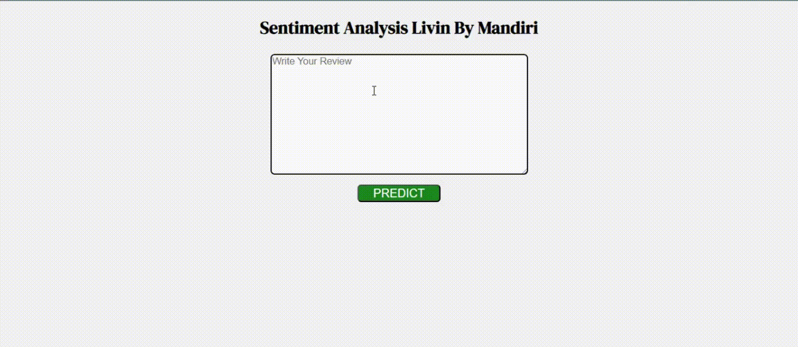

# Analyzing Livin' by Mandiri Reviews: Unveiling Customer Sentiment

### Snippet of WebApp 

## Overview

This project analyzes user reviews of the Livin' by Mandiri mobile banking app to understand customer sentiment and identify areas for improvement.

## Project Structure

- [code: Jupyter Notebook file for EDA, data cleaning, train model](sentiment-analysis-review-livin-by-mandiri-apps.ipynb)
- [data: User review dataset.](reviews.csv)
- [app: Python files for the Flask web app.](app.py)
- [results: Web app for make new prediction based on review.](web.git)

## Key Steps

- Data Collection: the data used in the project is taken from the Kaggle Dataset.
- Exploratory Data Analysis (EDA): Analyzed data to uncover patterns and insights.
- Data Cleaning: Cleaning the text so that it can be understood by the model, removing stop word, and applying lemmatization to the clean text.
- Model Development: Experimented with multiple machine learning models then Select logistic regression due to its superior accuracy.
- Web App Development: Built a Flask web app for sentiment prediction and visualization.

